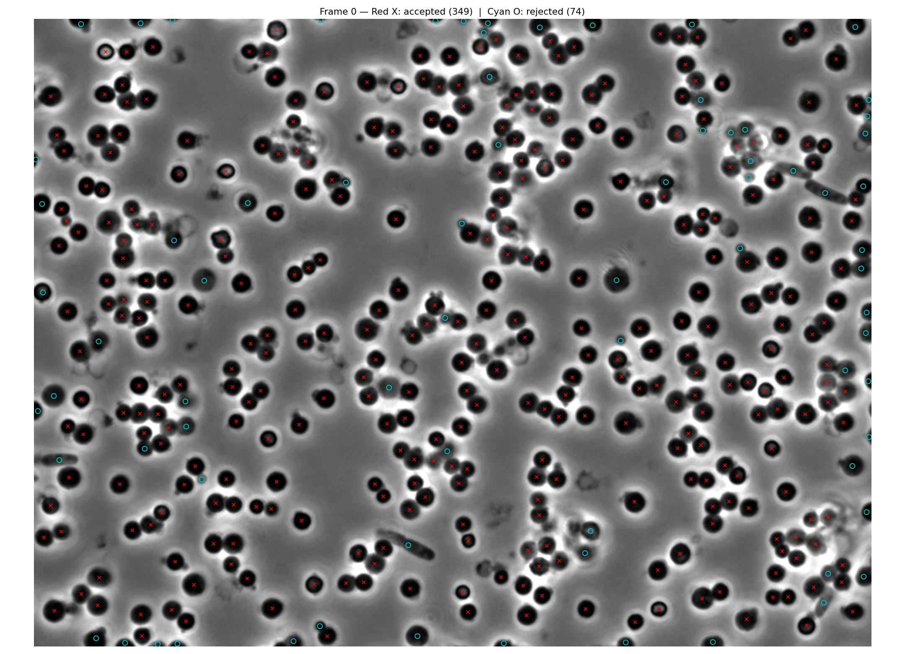
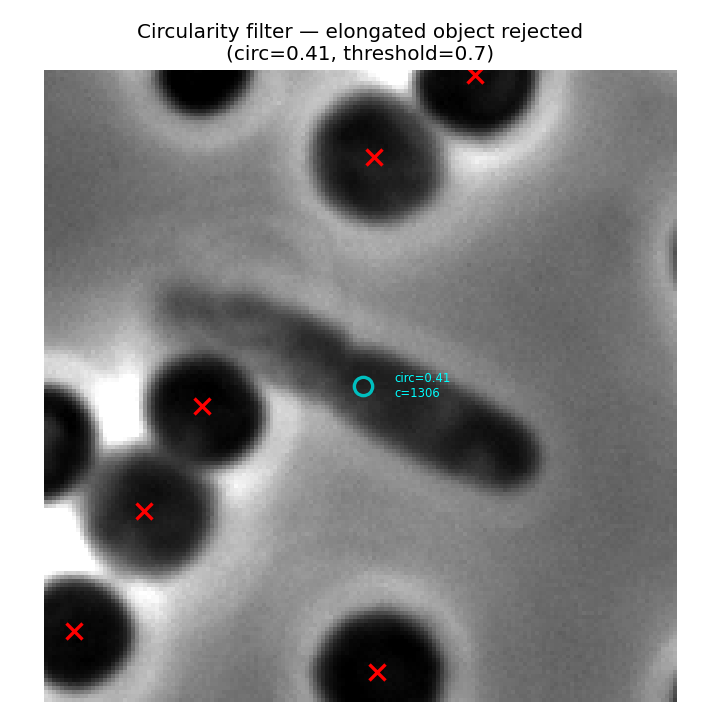
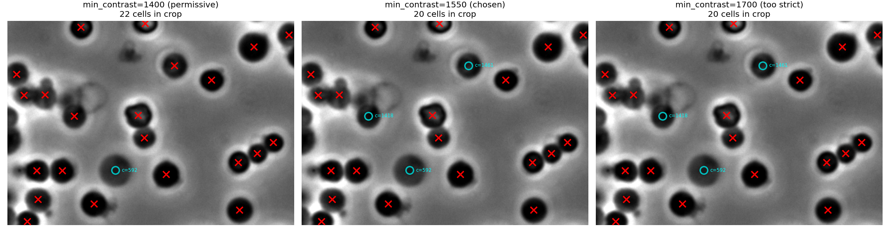
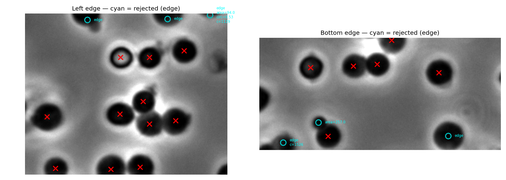
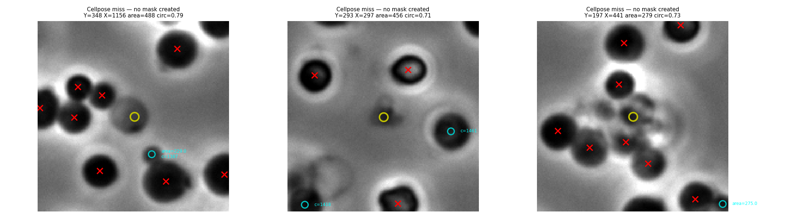

# Cell Detection Tuning Notes

Analysis performed on `Gradient-0011.zvi Ch0.tif` (25 frames, 1040x1388, uint16).
Round cells/bacteria, dark on lighter background with bright halos ("horns").

## Overview

Full frame with accepted detections (red X) and rejected detections (cyan O):



Cellpose finds ~423 raw detections. After post-filtering: ~349 accepted, ~74
rejected. Most rejections are for low contrast or edge location.

---

## Method comparison

| | Classical | Cellpose |
|---|---|---|
| Cells found | 340 | ~420 raw |
| False positives | Many (halo regions, background) | Very few |
| Centroid accuracy | Often shifted | Precise |
| Adjacent cells | Struggles to separate | Handles well |
| Speed (per frame) | Seconds | CPU 17s, MPS 3s, MPS+no_resample 0.3s |
| Dependencies | scikit-image, scipy | cellpose + PyTorch |

**Verdict: Cellpose is much better for this data.** Classical method kept as
fallback (`detect_cells_frame_classical()`).

---

## Filter parameters

All measurements from frame 0. Cellpose produces ~423 raw detections before
filtering.

### diameter = 32

Auto-detected median cell diameter. Passing explicitly skips auto-detection
and keeps results consistent across frames.

### min_area = 300

| Threshold | Effect |
|-----------|--------|
| 200 | Too permissive — lets in small faded blobs |
| **300** | **Good balance** — removes debris without losing real cells |
| 400 | Starts cutting real small cells |

Median cell area ~824 px. Debris/specks typically <200 px. A faded aggregate
cell (area=270) was confirmed as a false positive — 300 catches it.

### min_circularity = 0.7

Circularity = 4 * pi * area / perimeter^2 (1.0 = perfect circle).

- Round cells: median 0.93, range 0.7-1.0
- Elongated objects (rod bacteria, merged blobs): below 0.7

0.7 cleanly separates round cells from elongated artifacts.



The cyan circle marks an elongated object (circ=0.41) correctly rejected.
Round cells nearby are accepted (red X).

### min_contrast = 1550

Measured as intensity std-dev within the cell mask.



Left to right: the same crop at three contrast thresholds. Cyan circles show
rejected cells. At 1700 (right), several visually valid cells are lost. At
1400 (left), nearly everything passes. 1550 (center) is the chosen middle
ground.

| Threshold | Accepted (frame 0) | Notes |
|-----------|---------------------|-------|
| 1400 | 364 | Only truly faded cells rejected (~10) |
| **1550** | **~354** | **Good middle ground** |
| 1700 | 326 | Too strict — rejects 38 visually valid cells |

Distribution (cells passing area + circ + edge filters):
- Median: ~2000
- P5: ~1483
- P10: ~1638
- Truly faded/out-of-focus: <1400 (only ~10 cells)

`min_contrast` works in tandem with `min_area` — small faded blobs fail one
or both filters.

### exclude_edges = True

Rejects cells whose bounding box touches the frame border. Removes ~15-20
partial cells per frame.



Cyan circles at frame borders show partially cut-off cells being rejected.

---

## Performance

Apple Silicon (M3 Max): Cellpose auto-detects MPS (Metal) via `gpu=True`.

| Config | Time (200x200 crop) | Speedup |
|--------|---------------------|---------|
| CPU | 17.4s | 1x |
| MPS | 3.1s | 5.6x |
| MPS + resample=False | 0.3s | 58x |

`resample=False` skips Cellpose mask resampling. Returns masks at model's
internal resolution; code resizes them back with nearest-neighbor. Minimal
quality loss for centroid/area purposes.

---

## Known limitation: Cellpose segmentation misses

~5-6 round cells per frame have **no Cellpose mask at all**. These are cells
that the neural network fails to segment — typically cells squeezed between
neighbours or sitting in a dense cluster.



Yellow circles mark dark round blobs where Cellpose created no mask. These
cannot be recovered by adjusting post-filters (area, contrast, circularity)
because there is nothing to filter.

Round cells missed by Cellpose (frame 0):

| Y | X | Area | Circ | Context |
|---|---|------|------|---------|
| 348 | 1156 | 488 | 0.79 | Between detected cells |
| 293 | 297 | 456 | 0.71 | Between detected cells |
| 197 | 441 | 279 | 0.73 | Between detected cells |
| 667 | 121 | 276 | 0.82 | Near edge cluster |
| 563 | 746 | 223 | 0.91 | Small, between others |

### Cellpose parameters tested

| Config | Total masks | Missed cells recovered |
|--------|-------------|------------------------|
| d=32 (default) | 423 | baseline |
| d=28 | 421 | 0 |
| d=25 | 421 | 0 |
| d=32, cellprob_threshold=-2 | 417 | +1 (but loses 7 others) |
| d=32, flow_threshold=0.8 | 426 | 0 |
| d=28, cellprob_threshold=-2 | 417 | +1 (same tradeoff) |

None of the parameter changes recover missed cells without breaking existing
detections.

### Potential fix (not yet implemented)

A **hybrid fallback**: after Cellpose, scan for dark round blobs with no mask
and add them. Simple thresholding as a second pass, gated by area +
circularity. Would recover ~5 cells per frame.

---

## Cellpose warnings suppressed

These warnings are harmless and suppressed in `segmentation.py`:

- `"Resizing is deprecated in v4.0.1+"` — from `cellpose.dynamics` logger
  (not `cellpose.models`). Suppressed via
  `logging.getLogger("cellpose.dynamics").setLevel(logging.ERROR)`.
- `"Sparse invariant checks"` — PyTorch UserWarning. Suppressed via
  `warnings.filterwarnings`.

---

## Diagnostic tools

`scripts/diagnostic_overlay.py` generates visual overlays for any parameter
combination:

```bash
# Default parameters
python scripts/diagnostic_overlay.py

# Try different contrast
python scripts/diagnostic_overlay.py --min_contrast 1400

# Different frame, custom crops
python scripts/diagnostic_overlay.py --frame 5 --crops 150:400:250:600

# See all Cellpose raw output (no filtering)
python scripts/diagnostic_overlay.py --min_area 0 --min_contrast 0 --min_circularity 0 --no_exclude_edges
```

Output: `results/diagnostic_full.png` and `results/diagnostic_crops.png`.
