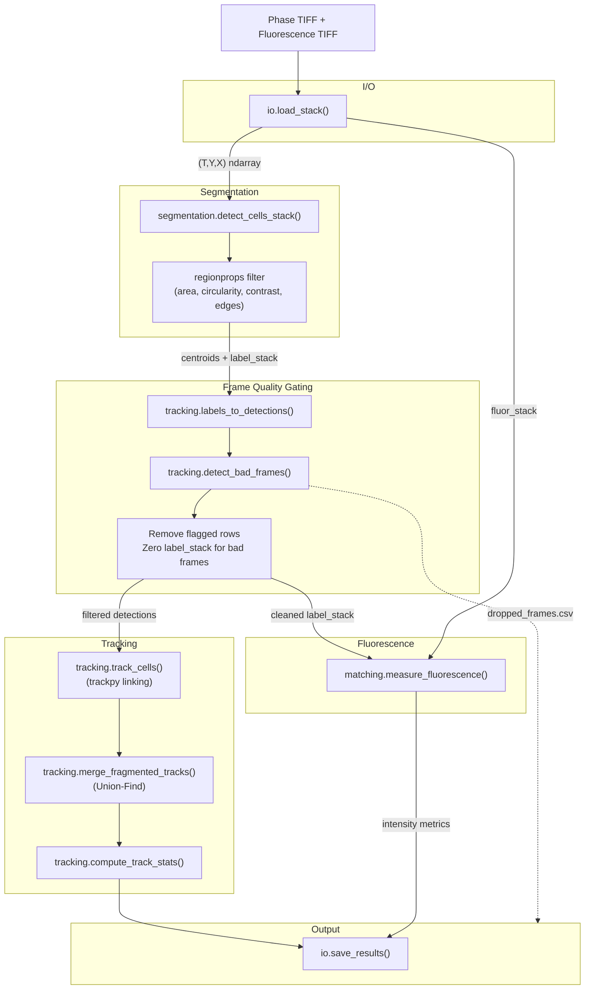
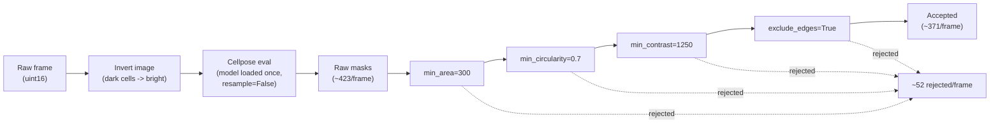
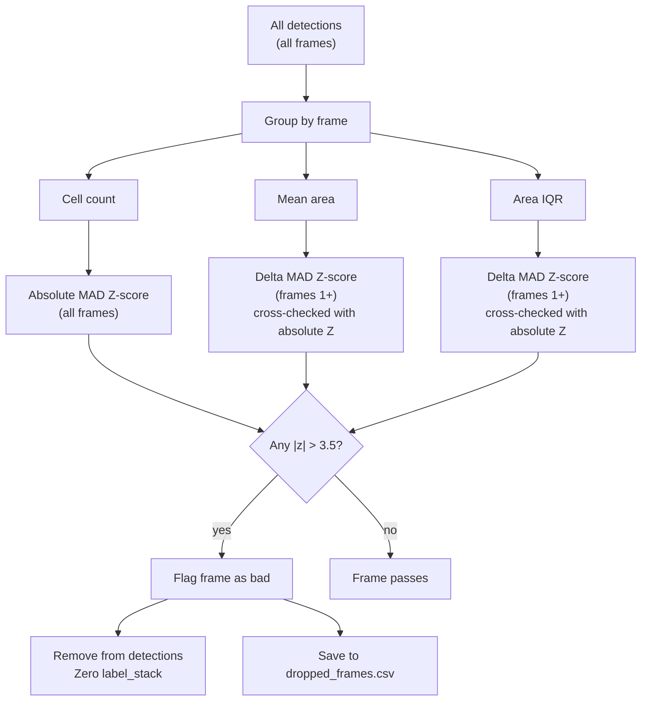
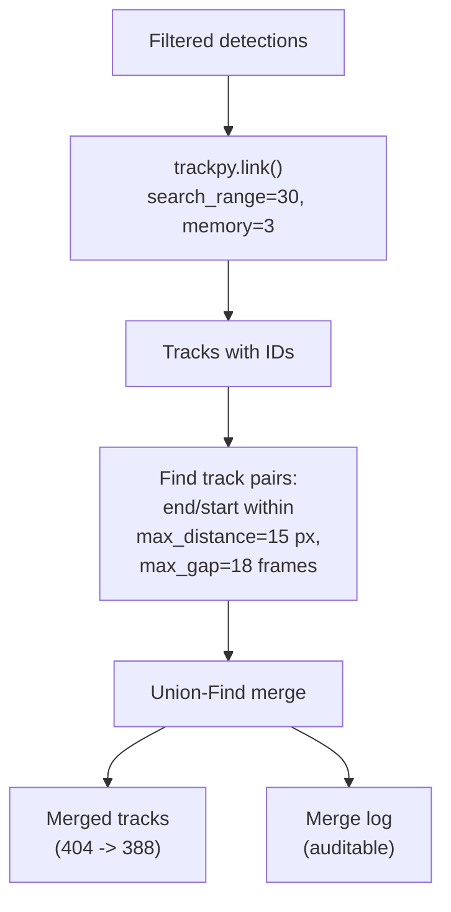
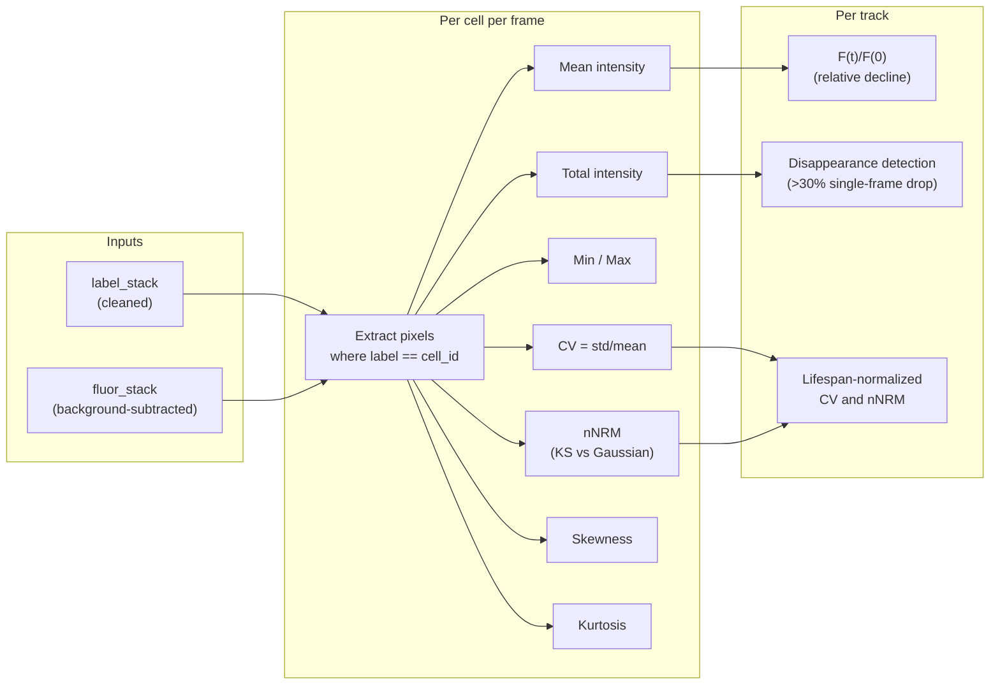
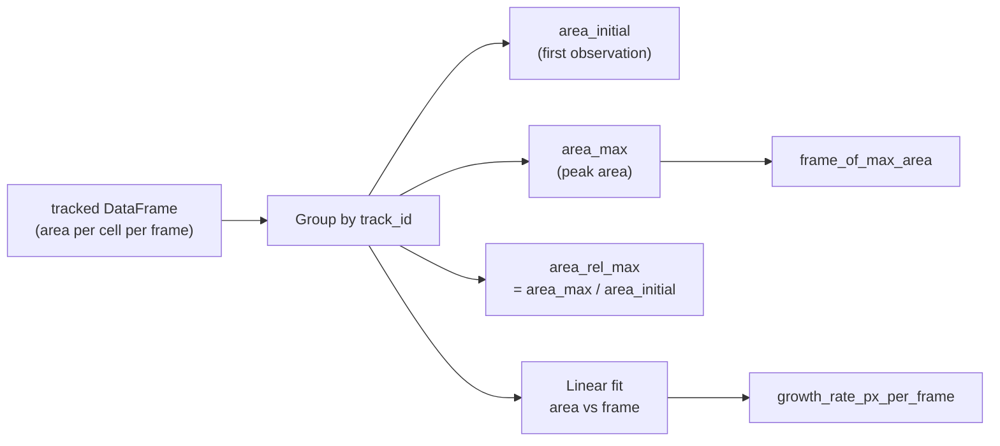
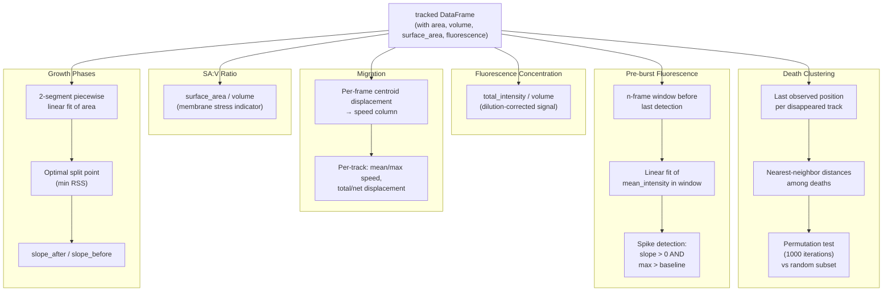

# Project Log: Bacterial Cell Detection, Tracking, and Fluorescence Analysis

Microscopy image analysis pipeline for bacterial cell detection, tracking, and fluorescence quantification in time-lapse phase-contrast stacks.

**Dataset:** `Gradient-0011.zvi` — 25 frames, 1040x1388, uint16.
- Phase-contrast channel: `Ch0.tif`
- Fluorescence channel (background-subtracted): `Ch1-BG.tif`

---

## Table of Contents

- [Pipeline Architecture](#pipeline-architecture)
- [Detection](#detection)
- [Tracking](#tracking)
- [Fluorescence Analysis](#fluorescence-analysis)
- [Output Artifacts](#output-artifacts)
- [Key Results](#key-results)
- [Open Questions and Limitations](#open-questions-and-limitations)
- [Future Work](#future-work)
- [Decision Log](#decision-log)
- [Progress Log](#progress-log)

---

## Pipeline Architecture

### End-to-end flow

### Detection detail

### Frame gating logic

### Tracking and merging

### Fluorescence measurement

### Per-track growth analysis

### Advanced statistics

Modules in `src/cell_analysis/`: `io.py`, `segmentation.py`, `tracking.py`, `matching.py`, `pipeline.py`, `plotting.py`.

Notebook entry point: `notebooks/analysis.ipynb`.

---

## Detection

### Method: Cellpose

Cellpose was selected over classical segmentation (threshold + watershed) after a head-to-head comparison.

| Metric | Classical | Cellpose |
|---|---|---|
| Cells found | 340 | ~420 raw |
| False positives | Many (halo regions, background) | Very few |
| Centroid accuracy | Often shifted | Precise |
| Adjacent cells | Struggles to separate | Handles well |
| Speed (per frame) | Seconds | CPU 17s, MPS 3s, MPS+no_resample 0.3s |

Classical method kept as fallback (`detect_cells_frame_classical()`).

### Post-detection Filters

Applied after Cellpose, before tracking. Tuned on frame 0 (~423 raw detections -> ~371 accepted, ~52 rejected).

| Parameter | Value | Rationale |
|---|---|---|
| `diameter` | 32 | Auto-detected median cell diameter. Explicit to ensure consistency across frames. |
| `min_area` | 300 | Removes debris (<200 px) and faded blobs (~270 px) without losing real cells. Median cell area ~824 px. |
| `min_circularity` | 0.7 | Separates round cells (median 0.93) from elongated artifacts (rods, merged blobs). |
| `min_contrast` | 1250 | Intensity std-dev within mask. Lowered from original 1550 after discovering ~22 cells/frame flickering around that threshold, causing track fragmentation. |
| `exclude_edges` | True | Rejects cells whose bounding box touches the frame border (~15-20 partial cells/frame). |

Full tuning details and diagnostic images: `docs/detection_tuning.md`.

### Known Limitation: Cellpose Misses

~5-6 round cells per frame have no Cellpose mask at all (typically squeezed between neighbors in dense clusters). Cannot be recovered by post-filter tuning. A potential hybrid fallback (classical second-pass for dark round blobs without masks) has been identified but not implemented.

### Performance

Benchmarked on Apple Silicon M3 Max, 200x200 crop:

| Config | Time (200x200 crop) | Speedup |
|---|---|---|
| CPU | 17.4s | 1x |
| MPS (Metal) | 3.1s | 5.6x |
| MPS + resample=False | 0.3s | 58x |

`resample=False` returns masks at Cellpose internal resolution; code resizes with nearest-neighbor. Minimal quality loss for centroid/area.

**Suppressed warnings:** Cellpose emits harmless logging warnings (not `warnings.warn`): `"Resizing is deprecated in v4.0.1+"` from `cellpose.dynamics` logger, and `"Sparse invariant checks"` PyTorch UserWarning. Both suppressed in `segmentation.py` via `logging.getLogger("cellpose.dynamics").setLevel(logging.ERROR)` and `warnings.filterwarnings`.

#### Hardware tuning guide

The pipeline adapts to available hardware via `DETECT_PARAMS` in the notebook. The two relevant settings are `gpu` and `resample`.

| Hardware | `gpu` | `resample` | Notes |
|---|---|---|---|
| Apple Silicon (M-series) | `True` | `False` | Cellpose auto-detects MPS (Metal). Best option on Mac. |
| NVIDIA GPU (CUDA) | `True` | `False` | Requires PyTorch with CUDA. Fastest option overall. |
| CPU only (any OS) | `False` | `False` | Slower but produces identical results. `resample=False` is the main speedup here — skipping it costs ~58x. |
| Low memory (<4 GB free) | `False` | `False` | GPU off avoids loading the model onto the accelerator. The stack itself is ~69 MB (25 frames x 1040x1388 x uint16) and the label stack ~138 MB (int32). Cellpose processes one frame at a time internally, so per-frame memory footprint stays small. |

**Key points:**

- `gpu=True` is a request, not a requirement. If no compatible GPU is found, Cellpose falls back to CPU silently. Setting `gpu=False` explicitly avoids the detection attempt and any related warnings.
- `resample=False` is hardware-independent and always recommended. It provides the largest single speedup (~58x) with negligible quality impact for centroid and area measurements. There is no reason to set it to `True` for this pipeline.
- All downstream modules (tracking, fluorescence measurement, frame gating) are pure numpy/pandas and run on CPU regardless. The hardware choice only affects the Cellpose segmentation step.

---

## Tracking

### Core Approach

1. **trackpy linking**: `track_cells()` links centroids between consecutive frames using `trackpy.link()` with `search_range=30.0` and `memory=3`.
2. **Track merging**: `merge_fragmented_tracks()` reconnects tracks broken by detection gaps longer than `memory`. Uses greedy spatial matching + Union-Find. Parameters: `max_distance=15.0 px`, `max_gap=18 frames`. Returns an auditable merge log.
3. **Track statistics**: `compute_track_stats()` produces per-track summary (lifetime, disappearance, mean area/volume/surface area, fluorescence metrics).

### Dynamic Frame Quality Gating

`detect_bad_frames()` replaces the old hardcoded `TRIM_FRAMES = 2` approach. Automatically detects anomalous frames anywhere in the time series.

**Signals used:**

| Signal | What it catches |
|---|---|
| Cell count per frame | Focus loss (count drops), segmentation artifacts (count spikes) |
| Mean cell area per frame | Defocus (blurred cells appear larger), partial field (smaller) |
| Area IQR per frame | Heterogeneous detection quality (some cells detected, some missed) |

**Method:** MAD-based modified Z-scores (robust to outlier contamination). Threshold: 3.5 (Iglewicz & Hoaglin recommendation).

**Per-signal strategy:**
- Cell count: absolute Z-scores (avoids the recovery-frame false positive from delta Z).
- Mean area / area IQR: delta Z-scores (handles biological trend of swelling), cross-checked with absolute Z (guards against statistical instability on short series).
- Frame 0: absolute Z-scores for all signals (no prior frame for deltas).

**What happens to flagged frames:**
- Removed from detections DataFrame before tracking.
- Frame numbers are NOT renumbered (trackpy bridges via `memory`; larger gaps handled by `merge_fragmented_tracks()`).
- Label stack zeroed for flagged frames (prevents fluorescence measurement).
- `dropped_frames.csv` saved for audit.

### Track Identity Fragmentation (Review 1)

**Problem:** Cells temporarily lost to detection (e.g., from an out-of-focus frame) get new track IDs when they reappear, fragmenting their history. 55 tracks started after frame 0; 16 were confirmed fragments of earlier tracks (<15 px, gaps 5-18 frames). Some form chains across multiple gaps (e.g., track 98 -> 388 -> 399: same cell across frames 0, 9-11, 17-23). The 28 tracks starting at frame 1 with >100 px distance from any prior track endpoint were confirmed as genuinely new, not fragments.

**Solutions implemented:**
1. Dynamic frame gating (replaced the earlier frame trimming approach).
2. Post-hoc track merging via `merge_fragmented_tracks()`.

**Result:** 404 -> 388 tracks (16 fragments absorbed), all 28 genuinely new frame-1 tracks untouched.

---

## Fluorescence Analysis

### Measurement Approach

Fluorescence intensity is measured within phase-contrast cell masks (not via independent segmentation of the fluorescence channel).

**Key assumptions:**

- Cell boundaries come from phase-contrast Cellpose segmentation. If phase masks are slightly too large or too small relative to the true fluorescence boundary, intensity values will be biased.
- No independent nucleus segmentation (yet). Whole-cell mask includes nucleus + cytoplasm. For a nuclear stain, most signal comes from the nucleus, but cytoplasmic background is included.
- Background subtraction is pre-applied (`Ch1-BG` input). ~7% of pixels are zero after subtraction. No additional background correction is applied.
- Phase and fluorescence channels are assumed spatially registered (same microscope, same objective, simultaneous acquisition). No registration or alignment step is performed.

### Metrics Computed

**Intensity:**
- Mean, total, min, max intensity per cell per frame.

**Distribution (nucleoid heterogeneity):**

- **CV** (coefficient of variation = std/mean): measures concentration vs. dispersal. High CV (~0.9) = bright nucleoid spots against dark cytoplasm (intact, concentrated). Low CV (~0.4-0.6) = more uniform distribution (dispersed nucleoid). Scale-invariant and directly interpretable.
- **nNRM** (Non-Normality Index): Kolmogorov-Smirnov statistic comparing pixel intensity distribution against a Gaussian with the same mean and std. Range [0,1]: 0 = perfectly Gaussian, 1 = maximally non-Gaussian. Complements CV — CV measures spread, nNRM measures distribution shape. A high nNRM indicates distinct subpopulations within the mask (bright nucleoid vs dark cytoplasm). Implementation: `scipy.stats.kstest(pixels, 'norm', args=(mean, std))`. ~0.9ms/cell. Reference: Gough et al. (2014), PLOS ONE, DOI: 10.1371/journal.pone.0102678.
- **Skewness**: asymmetry of pixel distribution. Positive skew = long right tail (bright outliers). Supplementary.
- **Kurtosis**: peakedness/tail heaviness (excess kurtosis, Fisher definition). Supplementary.

### Relative Fluorescence F(t)/F(0)

Computed for the frame-0 cohort only (tracks present at frame 0 with known baseline). F(0) is each cell's mean intensity at its first detection. Cells with F(0) = 0 are excluded to avoid division by zero.

### Fluorescence Disappearance Detection

Per-track detection of large single-frame drops in total intensity.

- Uses relative change (percentage drop) rather than absolute intensity because cells vary widely in baseline fluorescence. A 30% drop is biologically meaningful regardless of starting intensity.
- Formula: `delta = (I[t] - I[t-1]) / I[t-1]`. The frame with the largest single-frame drop exceeding the threshold is flagged.
- Threshold: -30% (tuned empirically; median max drop is -13%, -30% sits at ~8th percentile).

| Threshold | Tracks flagged | Specificity |
|---|---|---|
| -50% | 8/386 (2.1%) | 100% |
| -35% | 15/386 (4.0%) | 80% |
| **-30%** | **30/386 (7.8%)** | **83%** |
| -25% | 65/386 (17.2%) | - |

### Lifespan-Normalized Dynamics

For population-averaged CV and nNRM plots, each track's frame indices are mapped to relative lifespan [0, 1], then binned into 20 equal bins and averaged across all tracks. Aligns cells with different lifetimes to reveal the trajectory from "start of life" to "end of life" regardless of absolute timing. Tracks with fewer than 2 detections are excluded.

---

## Output Artifacts

### Pipeline outputs (notebook run)

```mermaid
flowchart TD
    subgraph NB["notebooks/analysis.ipynb"]
        run["Full pipeline run"]
    end

    subgraph CSV["CSV files"]
        tc["tracked_cells.csv\nPer-cell per-frame data"]
        ts["track_statistics.csv\nPer-track summary"]
        diag["frame_diagnostics.csv\nPer-frame detection statistics"]
        df["dropped_frames.csv\nFlagged frame audit log"]
        ml["merge_log.csv\nTrack merging audit"]
        fp["fate_predictions.csv\nPer-cell death predictions"]
        sg["spatial_gradient.csv\nPer-cell gradient quartiles"]
        np2["nucleus_persistence.csv\nPer-frame phase vs nucleus counts"]
    end

    subgraph SUMM["Summary CSVs (single-row, flattened)"]
        cs["clustering_summary.csv\nSpatial clustering test"]
        fps["fate_prediction_summary.csv\nAUC, feature importance"]
        sgs["spatial_gradient_summary.csv\nPer-axis stats, quartile rates"]
        nps["nucleus_persistence_summary.csv\nLoss counts, conclusion"]
    end

    subgraph PLOTS["Inline notebook plots"]
        p1["Cell count per frame\n(with flagged frames)"]
        p2["Lifetime distribution"]
        p3["Disappearance per frame"]
        p4["Area histogram\n(with volume axis)"]
        p5["V(t)/V(0) swelling curves"]
        p6["S(t)/S(0) swelling curves"]
        p7["F(t)/F(0) fluorescence curves"]
        p8["CV and nNRM temporal trends"]
        p9["Fluor vs volume scatter"]
        p10["Swelling vs initial size"]
        p11["Swelling vs DNA content"]
        p12["Growth before burst\n(aligned curves, rate & max size distributions)"]
        p13["Fluorescence concentration\n(time series, outcome split, vs volume)"]
        p14["Migration speed\n(time series, outcome split, distribution)"]
        p15["SA:V ratio\n(time series, outcome split, histogram)"]
        p16["Death clustering\n(spatial map, null distribution, temporal)"]
        p17["Pre-burst fluorescence\n(aligned curves, slope distribution, classification)"]
        p18["Growth phases\n(changepoint histogram, slope scatter, examples)"]
        p19["Fate prediction\n(ROC curve, feature importance, probability distribution)"]
        p20["Spatial gradient\n(scatter, quartile rates, density, correlation)"]
    end

    run --> tc & ts & diag & df & ml & fp & sg & np2
    run --> cs & fps & sgs & nps
    run --> p1 & p2 & p3 & p4 & p5 & p6 & p7 & p8 & p9 & p10 & p11 & p12 & p13 & p14 & p15 & p16 & p17 & p18 & p19 & p20
```

All saved to `results/<RUN_NAME>/` (default `results/run_01/`).

#### `tracked_cells.csv`

One row per cell per frame. Columns:

| Column | Description |
| --- | --- |
| `frame` | Raw frame index (0-based) |
| `label` | Cell label within that frame's mask |
| `centroid_y`, `centroid_x` | Cell centroid in pixels |
| `area` | Cell mask area in pixels |
| `track_id` | Unique track ID (after merging) |
| `radius` | Equivalent radius: sqrt(area / pi) |
| `volume` | Spherical volume: (4/3) pi r^3 |
| `surface_area` | Spherical surface area: 4 pi r^2 |
| `mean_intensity` | Mean fluorescence within cell mask |
| `total_intensity` | Sum of fluorescence within cell mask |
| `min_intensity` | Min fluorescence pixel value |
| `max_intensity` | Max fluorescence pixel value |
| `std_intensity` | Std dev of fluorescence within mask |
| `cv` | Coefficient of variation (std/mean) |
| `skewness` | Pixel distribution skewness |
| `kurtosis` | Pixel distribution excess kurtosis |
| `nnrm` | Non-Normality Index (KS statistic) |
| `speed` | Centroid displacement from previous frame (px) |
| `fluor_concentration` | total_intensity / volume (dilution-corrected) |
| `sav_ratio` | surface_area / volume (membrane stress indicator) |

#### `track_statistics.csv`

One row per track. Columns:

| Column | Description |
| --- | --- |
| `track_id` | Unique track ID |
| `first_frame`, `last_frame` | First and last frame of detection |
| `num_detections` | Number of frames where cell was detected |
| `lifetime` | last_frame - first_frame + 1 |
| `disappeared` | True if track ends before the final frame |
| `mean_area` | Time-averaged cell area |
| `mean_volume` | Time-averaged spherical volume |
| `mean_surface_area` | Time-averaged spherical surface area |
| `mean_fluor_intensity` | Time-averaged mean fluorescence |
| `mean_fluor_total` | Time-averaged total fluorescence |
| `mean_cv` | Time-averaged CV |
| `mean_nnrm` | Time-averaged nNRM |
| `area_initial` | Cell area (pixels) at first detection |
| `area_max` | Peak cell area (pixels) over track lifetime |
| `area_rel_max` | Peak area / initial area (growth factor) |
| `frame_of_max_area` | Frame at which cell reached peak size |
| `growth_rate_px_per_frame` | Linear growth rate (slope of area vs frame) |
| `fluor_disappearance_frame` | Frame of largest fluorescence drop (if > threshold) |
| `max_drop` | Largest single-frame relative drop in total intensity |
| `mean_speed` | Time-averaged centroid speed (px/frame) |
| `max_speed` | Maximum single-frame speed (px/frame) |
| `speed_std` | Standard deviation of per-frame speed |
| `total_displacement` | Sum of all step distances (px) |
| `net_displacement` | Straight-line distance from first to last position (px) |
| `preburst_slope` | Linear slope of mean_intensity in pre-burst window |
| `preburst_spike` | True if fluorescence spikes before disappearance |
| `changepoint_frame` | Frame of detected growth phase transition |
| `slope_before` | Area growth rate before changepoint (px/frame) |
| `slope_after` | Area growth rate after changepoint (px/frame) |
| `slope_ratio` | slope_after / slope_before |

#### `dropped_frames.csv`

One row per flagged frame (only created if frames are flagged). Columns: `frame`, `cell_count`, `mean_area`, `iqr_area`, `z_count`, `z_area`, `z_iqr`, `flagged`, `reasons`.

### Diagnostic overlay (manual)

Generated by `scripts/diagnostic_overlay.py`, saved to `results/`:

| File | Description |
| --- | --- |
| `diagnostic_full.png` | Full frame with accepted (red X) and rejected (cyan O) detections |
| `diagnostic_crops.png` | Six zoomed crops with rejection reason labels per cell |

---

## Key Results

### Detection and Tracking

| Metric | Value |
|---|---|
| Raw detections per frame | ~423 (Cellpose) |
| Accepted after filtering | ~371 per frame |
| Total tracks (after merging) | 388 |
| Tracks starting after frame 0 | 55 (28 genuine, 16 merged, rest accounted for) |

### Morphology and Swelling

| Metric | Value |
|---|---|
| Final V(t)/V(0), population mean | 1.690 +/- 0.029 |

Volume and surface area derived from area assuming spherical geometry: V = (4/3)pi*r^3, S = 4*pi*r^2, where r = sqrt(area/pi).

### Fluorescence

| Metric | Value |
|---|---|
| Fluorescence measurements | 7046 rows |
| Match rate (phase masks to fluor) | 100% |
| Median fluorescence per track | 2257 |
| Final F(t)/F(0), population | 0.652 +/- 0.013 (37% decline) |
| Total fluor vs volume (r) | 0.465 |
| Mean fluor vs volume (r) | -0.238 |
| CV (frame 0 -> 22) | 0.544 -> 0.466 |
| nNRM (frame 0 -> 22) | 0.113 -> 0.098 |
| Fluor drop before phase loss | 9/25 disappeared cells |
| Fluor drop at same frame | 16/25 disappeared cells |

### Key Biological Observations

1. **Population-level fluorescence decline**: mean intensity decreases monotonically (0.63x over 23 frames). Could be photobleaching, biological DNA loss, or dilution from swelling. Cannot distinguish without unstressed controls.

2. **Disappeared vs. survived cells**: cells that disappear lose fluorescence faster, visible from ~frame 8 onward. Suggests membrane integrity loss before visible lysis.

3. **Fluorescence-volume relationship**: total fluorescence positively correlated with volume (r=0.47); mean fluorescence weakly negatively correlated (r=-0.24). Consistent with dilution model — fluorophore content doesn't scale linearly with size.

4. **Nucleoid dispersal**: CV and nNRM both decline over time, indicating fluorescence becomes more uniformly distributed. Disappeared cells start with slightly higher CV but decline faster. Consistent with nucleoid decondensation preceding lysis.

5. **Fluorescence as leading indicator**: 9/25 disappeared cells showed fluorescence drop before phase disappearance, suggesting gradual membrane failure rather than instantaneous rupture.

6. **DNA does not persist after cell lysis**: Independent Cellpose segmentation of the fluorescence channel (diameter=25, ~422 nuclei/frame) shows nucleus counts decline in parallel with phase-contrast cell counts. Phase lost 171 cells, fluorescence lost 169 nuclei — near-identical rates. The constant ~50 offset (fluorescence detects more objects) is stable across all 25 frames (std ~3.5). This means fluorescent DNA disperses immediately upon membrane rupture rather than remaining as a discrete object.

7. **Death timing is accelerating, not constant-rate**: Deaths ramp from 1-7/frame (frames 0-10) to 12-20/frame (frames 14-20), then drop to 6-8/frame (frames 21-23). The late drop reflects population depletion, not reduced stress. Suggests cumulative/threshold-based damage rather than constant-rate killing.

8. **Nucleoid dispersal precedes lysis in 90% of dying cells**: CV drops from 0.632 (first frame) to 0.456 (last frame) in disappeared cells. Only 10% show CV increase before death — possibly a different death mechanism (rapid rupture without dispersal phase).

9. **Cell fate is partially predictable from frame-0 features**: Mann-Whitney tests on the frame-0 cohort show cells that will die are already different at the start — smaller area (p=0.0008), higher CV (p<0.0001), higher nNRM (p<0.0001). Initial nucleoid heterogeneity is the strongest early predictor of cell fate.

10. **Cells that die later are larger at death** (r=0.30, early death median area 859 px vs late death 1196 px). Supports a "swell until critical membrane threshold" model where cells accumulate osmotic stress until the membrane can no longer compensate.

11. **Fluorescence drops 3.5 frames before phase disappearance on average** (in the 35 tracks with detectable drops, mean delta = -3.5 frames). This early warning window is substantial and could potentially be used for real-time death prediction.

---

## Open Questions and Limitations

1. **Photobleaching vs. biology**: without an unstressed control time-lapse, photobleaching cannot be separated from actual fluorescence loss. A fixed-cell or untreated control with the same imaging conditions would enable calibration.

2. **Dilution correction**: total fluorescence partially accounts for dilution by swelling, but a more rigorous approach (comparing F_total(t)/F_total(0) vs. F_mean(t)/F_mean(0)) is needed to estimate the dilution component.

3. **Cellpose segmentation misses**: ~5-6 cells/frame have no mask. Parameter sweeps (diameter, cellprob_threshold, flow_threshold) did not recover them without breaking existing detections.

4. **Nucleus shape analysis**: Independent fluorescence segmentation now exists (`detect_nuclei_stack()`) and confirms nuclei don't persist after lysis. Nucleus-to-cell area ratio and condensation/fragmentation analysis via `match_cells_to_nuclei()` remain future work.

5. **Single dataset**: all tuning and validation performed on one 25-frame time-lapse. Generalization to other datasets, imaging conditions, or cell types is untested.

6. **Speed calculation assumed 1-frame gaps (fixed)**: `compute_migration_stats` originally divided displacement by 1, regardless of actual frame gaps. ~0.5% of consecutive detections had gaps > 1 frame (from dropped frames or detection gaps bridged by trackpy memory). Fixed by dividing displacement by actual frame difference. `total_displacement` (sum of raw distances) is unaffected; `mean_speed`, `max_speed`, `speed_std`, and per-frame `speed` column are now correct px/frame values.

7. **Nucleus persistence comparison fragile to bad frames (fixed)**: `run_nucleus_persistence` compared phase label counts (zeroed for bad frames by gating) against nucleus label counts (not zeroed). This would show a spurious offset spike on any bad frame. Fixed by skipping frames where phase labels are zeroed but nucleus labels are not.

8. **Ultra-short track artifacts**: 16 tracks with ≤3 detections are all classified as "disappeared." These may be transient segmentation artifacts (debris detected across a few frames) rather than real cells that died. A minimum-lifetime filter could reduce noise in disappearance statistics. Not yet implemented — requires choosing a threshold that doesn't discard genuine brief tracks.

---

## Future Work

- [ ] **Hybrid fallback for Cellpose misses**: classical second-pass for dark round blobs without masks (~5 cells/frame recovery).
- [ ] **Nucleus shape analysis**: segment nuclei in fluorescence channel independently, measure nucleus-to-cell area ratio, condensation/fragmentation. Use existing `match_cells_to_nuclei()` infrastructure.
- [ ] **Photobleaching calibration**: acquire or identify an unstressed control time-lapse for correction.
- [ ] **Dilution correction**: F_total(t)/F_total(0) vs. F_mean(t)/F_mean(0) comparison.
- [ ] **Multi-dataset validation**: test pipeline on additional datasets to check generalization of parameters.
- [x] **Minimum-lifetime filter**: `filter_short_tracks()` with configurable `MIN_TRACK_DETECTIONS` (default 4). Removes ultra-short tracks that are likely segmentation artifacts.
- [x] **Frame-0 fate prediction model**: logistic regression on area, CV, nNRM with LOO cross-validation. ROC curve, feature importance, and probability distribution plots.
- [ ] **Fluorescence early-warning system**: fluorescence drops ~3.5 frames before phase disappearance on average. Could be developed into a real-time predictor of impending cell death.
- [x] **Spatial gradient analysis**: `analyze_spatial_gradient()` with per-axis Mann-Whitney, point-biserial correlation, logistic regression AUC, and quartile death rate stratification.
- [ ] **Survival analysis (Kaplan-Meier / Cox PH)**: time-to-event framework instead of binary died/survived. Kaplan-Meier curves stratified by initial features (area quartiles, CV quartiles, gradient position). Cox proportional hazards model for multivariate survival time prediction.
- [ ] **Dynamic trajectory features for early warning**: rate of change in first 3-5 frames (area growth rate, CV slope, fluorescence decline rate) as predictors. Could enable "this cell will die within N frames" classifier.
- [ ] **Critical membrane threshold testing**: test whether area_rel_max at death clusters around a value (mechanical rupture threshold). Plot SA:V ratio at death — if membrane stress is the driver, should converge to a critical value regardless of initial size.
- [ ] **Neighborhood effects beyond gradient**: after accounting for gradient position, test whether cells near other dying cells die sooner. Local density at frame 0 vs fate could reveal crowding effects independent of drug gradient.

---

## Decision Log

Decisions, design choices, and their rationale. Most recent first.

### Dynamic frame gating replaces hardcoded TRIM_FRAMES

**Date:** 2026-04-16
**Context:** Pipeline originally dropped the first 2 frames via `TRIM_FRAMES = 2` because frame 1 was out of focus. This was brittle (only caught initial frames, fixed count, required manual tuning per dataset).
**Decision:** Replace with `detect_bad_frames()` using MAD-based Z-scores on per-frame detection statistics.
**Rationale:** Automatically detects anomalous frames anywhere in the series. Cell count uses absolute Z (avoids recovery-frame false positive); area/IQR use delta Z cross-checked with absolute Z (handles biological trend and short-series instability). Threshold 3.5 per Iglewicz & Hoaglin.
**Result on current dataset:** Zero frames flagged — correct. With the current `min_contrast=1250`, cell counts decline smoothly from 376 (frame 1) to 200 (frame 24) with no jumps or spikes. The original `TRIM_FRAMES=2` existed because "frame 1 was out of focus," but the real cause was the stricter `min_contrast=1550`: borderline cells in slightly defocused early frames fell below the contrast threshold, making frames 0-1 appear anomalous (fewer detections). Lowering `min_contrast` to 1250 (done to fix track fragmentation from ~22 cells/frame flickering around the old threshold) resolved the root cause, so the symptom (anomalous early frames) disappeared. The gating system is validated by unit tests to catch genuinely bad frames when they exist.

### Fluorescence disappearance: relative threshold, not absolute

**Context:** Needed to detect single-frame fluorescence loss events per track.
**Decision:** Use relative change (percentage drop) rather than absolute intensity change; threshold at -30%.
**Alternatives considered:** Absolute intensity drop threshold.
**Rationale:** Cells vary widely in baseline fluorescence. A 30% drop is biologically meaningful regardless of starting intensity. Median max drop is -13% (normal variation). -30% sits at ~8th percentile: captures 25/179 disappeared cells with only 5/200 false positives among survivors. -50% too strict, -25% too permissive.

### Per-cell per-frame data over time-averaged summaries

**Context:** Reviewer asked for time-averaged area. Cells actively swell over time as external osmotic pressure decreases.
**Decision:** Keep per-cell per-frame area in the data; derive volume/surface area per frame. Time-averaged area is computed for the track summary but is not the primary analysis metric.
**Rationale:** Averaging across time smears out the signal of interest (swelling dynamics). V(t)/V(0) and S(t)/S(0) relative curves preserve the temporal structure.

### nNRM over composite skewness/kurtosis metric

**Context:** Needed a scalar metric for pixel distribution non-normality within cell masks.
**Decision:** KS-based nNRM (Gough et al. 2014).
**Alternatives considered:** sqrt(skewness^2 + kurtosis^2).
**Rationale:** Published reference in high-content screening literature, captures all forms of non-normality in bounded [0,1] scalar, no weight-choosing between skewness and kurtosis.

### CV over Shannon entropy for heterogeneity

**Context:** Needed a metric for intra-cell fluorescence heterogeneity.
**Decision:** Coefficient of variation (std/mean).
**Alternatives considered:** Shannon entropy of pixel histogram.
**Rationale:** Simpler biological interpretation, no binning decisions required, explicitly requested by reviewer.

### min_contrast lowered from 1550 to 1250

**Context:** Tracking analysis revealed ~22 cells/frame flickering around the 1550 threshold, causing track fragmentation (new track IDs 359-377).
**Decision:** Lower to 1250.
**Rationale:** Recovers borderline cells (371 accepted at 1250 vs 349 at 1550), still rejects truly faded cells. Diminishing returns below 1250.

### Cellpose over classical segmentation

**Context:** Initial pipeline used threshold + watershed on phase-contrast images.
**Decision:** Switch to Cellpose with `resample=False` + MPS acceleration.
**Rationale:** Far fewer false positives, better centroid accuracy, handles adjacent cells. 58x speedup with resample=False makes it practical for full stacks. Classical method retained as fallback.

### Post-hoc track merging via Union-Find

**Context:** Cells temporarily lost to detection get new track IDs, fragmenting their history.
**Decision:** `merge_fragmented_tracks()` with greedy spatial matching + Union-Find.
**Rationale:** 16/55 late-starting tracks confirmed as fragments. Merging with max_distance=15 px, max_gap=18 frames reconnects them. Returns auditable merge log.

### Spherical geometry assumption for volume/surface area

**Context:** Reviewer requested volume and surface area analysis for swelling dynamics.
**Decision:** Assume spherical geometry: V = (4/3)pi*r^3, S = 4*pi*r^2, r = sqrt(area/pi).
**Rationale:** Reasonable for round bacteria. Volume changes more strongly during swelling than area; surface area enables estimation of critical membrane elastic stretch.

---

## Progress Log

Chronological record of completed work.

### Phase 1: Detection Pipeline

- [x] Cellpose integration with MPS acceleration and resample=False optimization
- [x] Post-detection filtering (area, circularity, contrast, edge exclusion)
- [x] Parameter tuning on frame 0 (documented in `docs/detection_tuning.md`)
- [x] Diagnostic overlay script (`scripts/diagnostic_overlay.py`)
- [x] Contrast threshold lowered from 1550 to 1250 after tracking analysis

### Phase 2: Tracking

- [x] trackpy-based centroid linking (search_range=30, memory=3)
- [x] Post-hoc track merging via Union-Find (max_distance=15, max_gap=18)
- [x] Track identity fragmentation analysis (404 -> 388 tracks)
- [x] Dynamic frame quality gating (`detect_bad_frames()`)
- [x] Replaced hardcoded TRIM_FRAMES with automatic detection

### Phase 3: Morphology Analysis (Review 1 Requests)

- [x] Cell count per frame, 50% disappearance frame, fraction disappeared
- [x] Lifetime distribution histogram, disappearance count per frame
- [x] Volume and surface area columns (spherical geometry)
- [x] V(t)/V(0) and S(t)/S(0) population-averaged swelling curves with SEM bands
- [x] Swelling extent vs. initial cell size (scatter + linear fit)
- [x] Swelling dynamics: disappeared vs. surviving cells

### Phase 4: Fluorescence Integration

- [x] Fluorescence measurement through phase-contrast masks (mean, total, min, max intensity)
- [x] Distribution metrics: CV, nNRM, skewness, kurtosis
- [x] Relative fluorescence F(t)/F(0) for frame-0 cohort
- [x] Fluorescence disappearance detection (per-track, -30% threshold)
- [x] Timing analysis: fluorescence drop vs. phase disappearance
- [x] Fluorescence vs. volume correlation
- [x] CV and nNRM temporal trends, disappeared vs. survived comparison
- [x] Lifespan-normalized dynamics
- [x] Swelling rate/extent dependence on DNA content

### Phase 5: Growth Analysis

- [x] Per-track growth metrics: initial area, peak area, relative max size, growth rate (linear fit)
- [x] `compute_growth_stats()` in tracking module, `add_growth()` pipeline function
- [x] Growth-before-burst visualization: area curves aligned to burst frame, growth rate and max size distributions (disappeared vs survived)

### Phase 6: Advanced Statistics

- [x] **Fluorescence concentration** (`fluor_concentration = total_intensity / volume`): dilution-corrected fluorescence signal, distinguishing true fluorescence loss from dilution by swelling
- [x] **Cell migration speed**: per-frame centroid displacement, per-track mean/max/std speed, total and net displacement
- [x] **SA:V ratio dynamics** (`surface_area / volume`): membrane stress indicator, tracks how surface-to-volume ratio changes as cells swell
- [x] **Spatial clustering of cell death**: nearest-neighbor distance analysis among disappeared cells, permutation test (1000 iterations) comparing observed clustering to random subsets
- [x] **Pre-burst fluorescence behavior**: linear fit of mean_intensity in n-frame window before disappearance, spike detection (positive slope + max exceeds baseline)
- [x] **Growth phase detection**: 2-segment piecewise linear fit minimizing RSS, identifies changepoint frame and slope ratio (acceleration/deceleration)
- [x] Pipeline wiring: `add_fluorescence_concentration()`, `add_migration()`, `add_sav_ratio()`, `add_death_clustering()`, `add_preburst_fluorescence()`, `add_growth_phases()`
- [x] Visualization: 6 new 3-panel plot functions in `plotting.py`
- [x] Exports updated in `__init__.py`
- [x] 40 tests passing across all new features

### Phase 7: Nucleus Persistence Analysis

- [x] Independent fluorescence channel segmentation via `detect_nuclei_stack()` (Cellpose, diameter=25, no inversion needed)
- [x] `run_nucleus_persistence()` pipeline function: frame-by-frame count comparison with automated conclusion
- [x] `plot_nucleus_persistence()` visualization: count overlay + offset stability chart
- [x] **Finding**: DNA does not persist as discrete object after lysis — phase and fluorescence counts decline in parallel (171 vs 169 lost)

### Phase 7 post-review fixes

- [x] Removed unused `fluor_stack` parameter from `run_nucleus_persistence()` — frame count is derived from `label_stack`
- [x] Added shape validation assertion between `label_stack` and `nucleus_label_stack`
- [x] Strengthened conclusion logic: now requires **both** an endpoint test (total loss agreement within tolerance) **and** a trajectory test (offset CV below threshold) to conclude "parallel". Previously only checked endpoints, which could miss divergent mid-trajectory behavior
- [x] Added inline comment in `detect_nuclei_stack()` explaining why no image inversion is needed (fluorescence nuclei already bright on dark, unlike phase-contrast)
- [x] Removed explicit `channels=[0, 0]` from `detect_nuclei_stack()` for consistency with `detect_cells_frame()` (Cellpose defaults to `[0, 0]` for grayscale)
- [x] Moved `detect_nuclei_stack`, `run_nucleus_persistence`, `plot_nucleus_persistence` imports to top-level notebook import cell

### Phase 8: Data Quality Fixes

- [x] **Speed calculation bug fix**: `compute_migration_stats()` now divides displacement by actual frame gap instead of assuming 1-frame intervals. Affects ~0.5% of steps where trackpy memory bridged multi-frame gaps. New test `test_frame_gap_normalizes_speed` validates the fix.
- [x] **Nucleus persistence bad-frame fix**: `run_nucleus_persistence()` now skips frames where phase `label_stack` was zeroed by frame gating but `nucleus_label_stack` was not, preventing spurious offset spikes.
- [x] Documented 3 methodological issues in Open Questions (speed bug, bad-frame fragility, ultra-short tracks)
- [x] Added 3 new Future Work items (minimum-lifetime filter, frame-0 fate prediction, fluorescence early-warning)
- [x] 41 tests passing

### Phase 9: Minimum-Lifetime Filter and Notebook Integration

- [x] **Minimum-lifetime filter**: `filter_short_tracks()` pipeline function removes tracks with <N detections. Default `MIN_TRACK_DETECTIONS=4` in notebook config. Explained in notebook markdown.
- [x] **Notebook wiring for all advanced statistics**: growth analysis (`add_growth`, `plot_growth_before_burst`), growth phases, fluorescence concentration, migration speed, SA:V ratio, death clustering, pre-burst fluorescence — all now called from the notebook with explanatory markdown cells
- [x] Updated notebook imports, config cell, and export section description
- [x] Updated Future Work: minimum-lifetime filter marked as done

### Phase 10: Cell Fate Prediction

- [x] `predict_fate_from_frame0()` in `matching.py`: logistic regression with LOO cross-validation on frame-0 features (area, CV, nNRM). Returns per-cell predictions and summary (AUC, accuracy, feature importance).
- [x] `add_fate_prediction()` pipeline wrapper in `pipeline.py`
- [x] `plot_fate_prediction()` 3-panel visualization: ROC curve, feature importance bar chart, probability distribution by outcome
- [x] Notebook cells with explanatory markdown
- [x] 4 unit tests passing (output structure, AUC > random, custom features, count consistency)
- [x] 45 tests total passing

### Phase 11: Spatial Gradient Analysis

- [x] `analyze_spatial_gradient()` in `matching.py`: Mann-Whitney U test, point-biserial correlation, and logistic regression AUC for each axis (centroid_x, centroid_y). Auto-detects dominant gradient axis, bins into spatial quartiles with per-quartile death rates.
- [x] `add_spatial_gradient()` pipeline wrapper in `pipeline.py`
- [x] `plot_spatial_gradient()` 4-panel visualization: spatial scatter by fate, death rate by quartile, position distribution along gradient axis, per-axis correlation bar chart
- [x] Notebook cells with explanatory markdown (between fate prediction and nucleus persistence)
- [x] 5 unit tests passing (output structure, detects X gradient, quartile rates increase, AUC > random, counts sum)
- [x] 50 tests total passing
- [x] Documented 5 future research directions: spatial gradient analysis, survival analysis (Kaplan-Meier/Cox PH), dynamic trajectory features, critical membrane threshold testing, neighborhood effects beyond gradient
